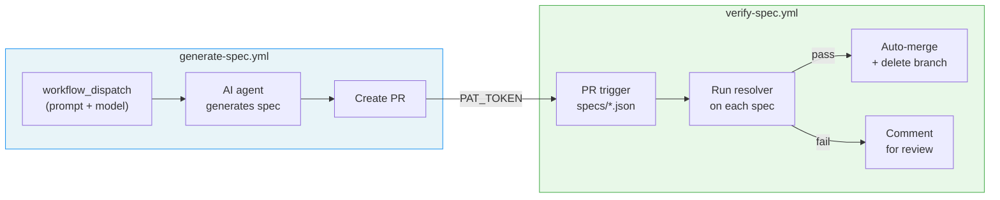

# Voran

Deterministic single-event oracle for on-chain settlement. AI generates the resolution specs, a pure-function engine executes them.

## How it works

```mermaid
flowchart LR
    subgraph A["Layer A — AI Agent"]
        direction TB
        P["Natural language prompt"] --> T["Tools: search registry,\nfetch URLs, test extraction"]
        T --> S["ResolutionSpec JSON"]
    end

    subgraph B["Layer B — Deterministic Resolver"]
        direction TB
        F["Fetch\nHTTP / Browser"] --> E["Extract\nJSONPath / Script"]
        E --> X["Transform & Evaluate"]
        X --> SIG["Hash & Sign\nkeccak256 + EIP-191"]
    end

    subgraph C["On-chain"]
        V["VoranOracle\nverify + settle"]
    end

    A -->|spec committed| B
    B -->|signed payload| C

    style A fill:#e8f4f8,stroke:#2196F3
    style B fill:#e8f8e8,stroke:#4CAF50
    style C fill:#f8f0e8,stroke:#FF9800
```



**Layer A** (flexible) — An agentic AI generates structured `ResolutionSpec` JSON from natural language. It searches registries and saved templates, fetches URLs, tests extractions, and iterates until the spec works. Supports interactive chat mode and batch template generation.

**Layer B** (deterministic) — A frozen resolver engine executes the spec: fetches data, extracts a value, applies a transform, evaluates a rule, and signs the result. No AI at runtime.

## Quick start

```bash
cp .env.example .env
# Add at least one AI provider key (ANTHROPIC_API_KEY, OPENAI_API_KEY, etc.)

npm install

# Generate a spec from natural language
npm run generate-spec -- "Will BTC exceed $100,000?"

# Run the resolver on an existing spec
npm run run-resolver -- specs/example-btc.json
```

## Resolution specs

A `ResolutionSpec` defines exactly how to resolve a market — what to fetch, how to extract a value, and what rule to evaluate.

### HTTP source (JSON APIs)

```json
{
  "marketId": "btc-jan1-2026",
  "source": {
    "type": "http",
    "method": "GET",
    "url": "https://api.coinbase.com/v2/prices/BTC-USD/spot"
  },
  "extraction": { "type": "jsonpath", "path": "$.data.amount" },
  "transform": { "type": "decimal" },
  "rule": { "type": "greater_than", "value": 100000 }
}
```

### Browser source (JS-rendered pages)

For pages that require JavaScript to render (SPAs, esports stats sites, etc.), specs use `source.type: "browser"` which launches headless Chromium via puppeteer:

```json
{
  "marketId": "lpl-weibo-vs-bilibili-game1-week1-2026",
  "source": {
    "type": "browser",
    "url": "https://gol.gg/game/stats/73160/page-game/",
    "waitFor": ".blue-line-header"
  },
  "extraction": {
    "type": "script",
    "lang": "javascript",
    "code": "function extract(rawResponse) { ... }"
  },
  "transform": { "type": "decimal" },
  "rule": { "type": "greater_than", "value": 0.5 }
}
```

### Extraction types

| Type | Use case | Details |
|------|----------|---------|
| `jsonpath` | JSON APIs | JSONPath expression, uses first match |
| `script` | HTML, XML, complex JSON | Sandboxed JS function `extract(rawResponse) → string` |

### Transforms

| Type | Input | Output |
|------|-------|--------|
| `decimal` | String number | `parseFloat(value)` |
| `score_diff` | `{"home":2,"away":1}` | `home - away` |
| `score_sum` | `{"home":2,"away":1}` | `home + away` |

### Rules

`greater_than`, `less_than`, `equals` — compared against `rule.value`.

### Secrets

Header values support `$env:VAR_NAME` to reference environment variables at runtime, keeping API keys out of committed specs.

## AI spec generation

The `generate-spec` command runs an agentic loop that researches data sources, tests extractions against real data, and submits a validated spec.

```bash
# Simple API-based market
npm run generate-spec -- "EUR/USD above 1.10"

# Browser-rendered esports page
npm run generate-spec -- "Weibo Gaming wins Game 1 vs Bilibili Gaming" --max-steps 25

# With options
npm run generate-spec -- "NYC temperature above 30C" \
  --model openai/gpt-4o \
  --dry-run \
  --verbose \
  --output specs/my-spec.json
```

### Template generation

When a prompt describes multiple related markets, the agent generates a template instead of individual specs:

```bash
# Price thresholds — one AI run, 3 specs
npm run generate-spec -- "AMZN close above {price} Mar 2? Thresholds 200,210,220" --output-dir /tmp/specs

# Sports fixtures — paired params
npm run generate-spec -- "EPL match winners: Arsenal FC vs Chelsea FC md29, Liverpool FC vs Man City md30, season 2025" --output-dir /tmp/specs
```

### Interactive chat mode

The `--chat` flag enables multi-turn conversation. The agent asks for missing details before generating:

```bash
npm run generate-spec -- "EPL match winner" --chat --verbose
# Agent: "Which teams and matchdays?"
# You: "Arsenal FC vs Chelsea FC md29, season 2025"
# Agent: [generates spec]
```

### Template library

Saved templates let the agent reuse verified patterns without re-researching data sources:

```bash
# Save a successful template
npm run generate-spec -- "..." --save-template epl-match-winner

# Next time, the agent finds it automatically via search_templates
npm run generate-spec -- "EPL match winner Arsenal vs Chelsea md29"
```

### Agent tools

| Tool | Purpose |
|------|---------|
| `search_registry` | Find curated data sources by keyword |
| `search_templates` | Find saved template patterns by keyword |
| `fetch_url` | Inspect a URL response (plain HTTP or headless browser) |
| `test_extraction` | Run extraction + transform against real data |
| `submit_spec` | Validate and submit the final spec |
| `submit_template` | Submit a parameterized template for batch expansion |

### Supported AI providers

Set one API key in `.env` (auto-detected), or specify with `--model provider/model-id`:

| Provider | Env var | Default model |
|----------|---------|---------------|
| Anthropic | `ANTHROPIC_API_KEY` | `claude-sonnet-4-20250514` |
| OpenAI | `OPENAI_API_KEY` | `gpt-4o` |
| Google | `GOOGLE_GENERATIVE_AI_API_KEY` | `gemini-2.0-flash` |
| DeepSeek | `DEEPSEEK_API_KEY` | `deepseek-chat` |
| Qwen | `DASHSCOPE_API_KEY` | `qwen-plus` |
| Doubao | `ARK_API_KEY` | `doubao-seed-2-0-pro-260215` |

## Resolver pipeline

```mermaid
flowchart LR
    subgraph resolve["resolve(spec)"]
        direction LR
        S1["📄 Load spec"] --> S2["🌐 Fetch\nHTTP / Puppeteer"]
        S2 --> S3["🔍 Extract\nJSONPath / VM sandbox"]
        S3 --> S4["⚙️ Transform\ndecimal / score_diff"]
        S4 --> S5["📏 Evaluate rule\n> < ="]
        S5 --> S6["🔐 Sign\nkeccak256 + EIP-191"]
    end

    style resolve fill:#f5f5f5,stroke:#666
```



Output is a signed payload ready for on-chain settlement:

```json
{
  "marketId": "0x...",
  "specHash": "0x...",
  "rawHash": "0x...",
  "parsedValue": "67811.995",
  "result": false,
  "executedAt": 1772181492,
  "signature": "0x..."
}
```

## Smart contract

The `VoranOracle` contract (Solidity, Foundry) verifies the signed payload:

1. Reconstructs `messageHash` using `abi.encodePacked`
2. Recovers signer via `ecrecover`
3. Verifies `specHash` matches stored value
4. Settles the market

```bash
# Local e2e (requires Foundry + Anvil)
npm run e2e
```

## Project structure

```
src/
  ai/           Agent-based spec generation (tools, prompt, validation)
  ai/template-library.ts  Saved template patterns (load, search, save)
  cli/          CLI commands (generate-spec, run-resolver, create/settle-market)
  resolver/     Deterministic resolution engine (fetch, extract, transform, evaluate, sign)
  registry/     Curated data source descriptors
  types.ts      Core TypeScript interfaces
contracts/      Solidity (VoranOracle + Foundry tests)
specs/          Example and generated resolution specs
templates/      Saved template patterns for reuse
```

## CI/CD



Two GitHub Actions workflows form a verify-then-merge pipeline:

### Generate Spec (`generate-spec.yml`)

Triggered manually via `workflow_dispatch`. Runs the AI agent to produce spec(s) and creates a PR.

```bash
# Via CLI
gh workflow run generate-spec.yml \
  -f prompt="Will Arsenal win next match against Chelsea?" \
  -f title="Arsenal vs Chelsea" \
  -f model="doubao/doubao-seed-2-0-pro-260215"
```

| Input | Required | Description |
|-------|----------|-------------|
| `prompt` | Yes | Natural language market description |
| `title` | No | Short run title for Actions UI |
| `model` | No | LLM provider/model (auto-detects if empty) |
| `max_steps` | No | Max agent steps (default: 15) |

**Required secrets:** `PAT_TOKEN` (for PR creation), at least one LLM API key, data source keys as needed.

### Verify Spec (`verify-spec.yml`)

Triggered automatically on PRs that modify `specs/*.json`. Runs the deterministic resolver on each changed spec. Auto-merges on success; comments on failure for manual review.

**Required secrets:** `RESOLVER_PRIVATE_KEY`, data source API keys (`FOOTBALL_DATA_API_KEY`, etc.).
